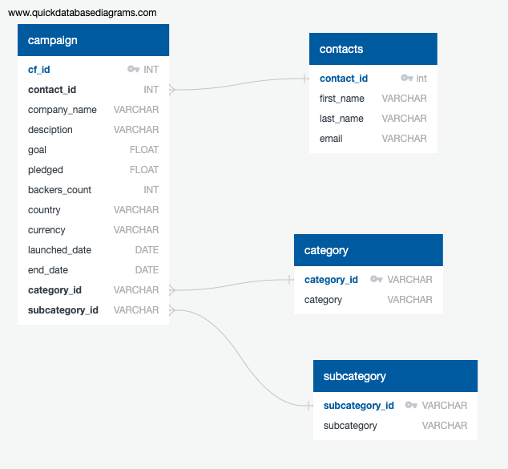

# Crowdfunding_ETL

## Purpose:

The purpose of this project is to find trends in crowdfunding campaigns. Some questions to be investigated include:
   1. What countries have the most successful campaigns? 
   2. Which categories of campaigns have the most/least success?
   3. Any contacts trying to lead multiple campagins under different company names? 

## Methodology: 

### Repository: 
    * ETL_Mini_project_JShulyak.ipynb
    * crowdfunding_db_schema.sql
    * crowdfunding_exploration.sql
    * Resources
        * campaign.csv 
        * category.csv 
        * contacts.csv 
        * contacts.xlsx 
        * crowdfunding.xlsx 
        * subcategory.csv
    * Images
        * crowdfunding_db_ERD.png
        * postgres_tables_select_statements.png 

### ETL in Python:

The crowdfunding.xlsx and contacts.xlsx files were loaded into Pandas Dataframes. The dataframes were cleaned and transformed into four organize dataframes. The transformations that occurred included breaking apart columns, converting the date data to datetime format, dropping unwanted fields, and creating primary keys. The transformed dataframes: 

   1. category:
      * category_id (string)
      * category (string)
   2. subcategory:
      * subcategory_id (string)
      * subcategory (string)
   3. campaign:
      * cf_id (integer)
      * contact_id (integer)
      * company_name (string)
      * description (string)
      * goal (float)
      * pledged (float)
      * backers_count (integer)
      * country (string)
      * currency (string)
      * launch_date (date)
      * end_date (date)
      * category_id (string)
      * subcategory_id (string)
   4. contact:
      * contact_id (integer)
      * first_name (string)
      * last_name (string)
      * email (string)
       
The four transformed dataframes were written as csv files to load into a PostgreSQL database. 

### Entity Relationship Diagram:

### Data Exploration in PostgreSQL:

Schema written in PostgreSQL to build and populate tables (one for each transformed csv).

Schema written to answer questions and explore data.

## Analysis:

   1. What countries have the most successful campaigns? 
   2. Which categories of campaigns have the most/least success?
      * 100% of journalism campaigns have been successful, but there have only been 4 journalism campaigns total.
      * Technology canpaigns are the next most successful with a success rate of 66.67% from a sample of 96 technology campaigns.
      * Game campaigns have been the least successful with a success rate of 43.75% from a sample of 48 campaigns.
      * 
   4. Any contacts trying to lead multiple campagins under different company names? 
